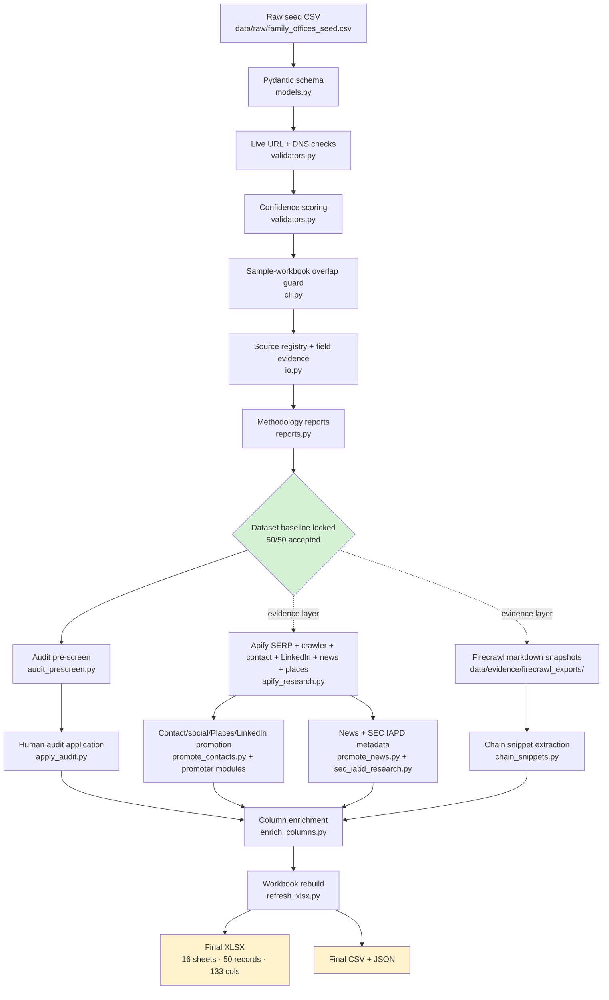

# PolarityIQ — Family Office Dataset & RAG Pipeline

> **Status:** Dataset ✅ Locked · RAG ✅ Added · HVL submission packet ✅ Added
> **Submission for:** PolarityIQ Stage 1 Differentiator Assessment

A validated, evidence-backed dataset of 50 real Family Office records, built with visible reasoning at every step. Every promoted field is paired with a source URL and a confidence label; every gap is honestly disclosed. The repository now includes the local RAG demo in `rag_demo/` plus a submission packet for the Stage 1 Human Validation Layer review.

---

## TL;DR

- **What this produces:** 50 validated Family Office records (`data/processed/family_offices_validated.xlsx`) with a 16-sheet audit trail (sources, field evidence, validation results, Apify/Firecrawl evidence, SEC IAPD outputs, contact info, news signals, LinkedIn enrichment, Google Places, Form ADV parsed fields, team rosters, validation chain snippets, data dictionary).
- **Headline metrics:** 50 / 50 records accepted, all `confidence=high`, 112 source URLs (≥2 per record), 133 dataset columns, 2,135 field-evidence rows, 180 tests passing at 90.53 % coverage, ruff clean, `pip-audit` clean.
- **RAG audit:** `rag_demo/reports/eval_report.md` now uses a 45-question adversarial set with realistic misses and known limitations rather than a polished all-1.000 report.
- **HVL discipline:** every field follows the Observe → Question → Hypothesize → Build → Validate loop. The methodology file documents what was observed, what was assumed, what could be wrong, and what would change the conclusion. Unverified output is treated as worse than no output.

---

## Submission Map

Open these first:

- `SUBMISSION_COVER.md` - evaluator index, demo map, and known limitations.
- `00_family_office_records.csv` - evaluator-friendly 50-row dataset CSV at repo root.
- `EFFORT_AND_AI_DISCLOSURE.md` - hours breakdown and AI-vs-human disclosure.
- `reports/methodology_summary.md` - dataset methodology and honest limitations.
- `reports/validation_chains.md` - source-to-field validation chains.
- `rag_demo/reports/eval_report.md` - honest 45-question RAG evaluation.
- `rag_demo/src/ui/app.py` - Streamlit evidence review console.
- `demo/task1_rag_walkthrough.mp4` - local screen-recording fallback covering the six required demo scenarios.
- `DEPLOYMENT_OR_RECORDING_NOTES.md` - live URL or recording checklist.

---

## Pipeline Architecture



The solid arrows show the deterministic validation pipeline. The dotted "evidence layer" arrows show the optional scraper-evidence enrichments (Apify + Firecrawl) — each runs independently and their outputs feed the contact / chain / news / column promoters. The pipeline is **explicitly sequenced**: every promoter reads from already-validated state, never bypasses it.

---

## Quickstart

```powershell
# 1. Install (editable, with all deps)
cd D:\path\to\polarity-fo-dataset-rag
python -m pip install -e .

# 2. Run the deterministic validator (rebuilds processed/ from raw seed)
python -m fo_dataset_pipeline.cli `
    --input data/raw/family_offices_seed.csv `
    --required-count 50

# 3. Run the test + lint + audit gates
python -m pytest tests/ --cov=. --cov-report=term-missing --cov-fail-under=80
python -m ruff check .
pip-audit -r rag_demo\requirements.txt
```

Expected output of step 2: `Processed 50 records; accepted 50; reports written to reports`.

---

## Module Reference

All modules live in `src/fo_dataset_pipeline/`. Each is a self-contained Typer CLI.

| Module | Purpose | Invoke |
|---|---|---|
| `models.py` | Pydantic v2 schemas for raw and validated records, plus the FamilyOfficeType + EvidenceQuality enums. Rejects placeholder values, empty URLs, fewer than 2 sources. | (imported) |
| `validators.py` | Async live HTTP checks, DNS resolution fallback, name normalization, sample-workbook overlap detection, confidence scoring. | (imported) |
| `io.py` | Reads seed CSV, builds source registry / field evidence / validation results sheets, writes CSV + XLSX + JSON outputs. | (imported) |
| `reports.py` | Generates the markdown methodology + validation reports. | (imported) |
| `cli.py` | **Main entry point.** Runs schema validation → live URL check → scoring → outputs in one command. | `python -m fo_dataset_pipeline.cli --input … --required-count 50` |
| `apify_research.py` | Apify integration (SERP scraper, website crawler, contact scraper, LinkedIn, Google News, Google Places). Reads `APIFY_TOKEN` from env. | `python -m fo_dataset_pipeline.apify_research write-inputs / run-search / run-evidence-crawl / build-evidence-summary / flatten-serp` |
| `audit_prescreen.py` | Adds `human_audit_status` / `auto_prescreen_flag` / `auto_prescreen_reason` columns. Flags 9 of 50 rows for closer review (service-provider MFOs + brand-abbreviated domains). | `python -m fo_dataset_pipeline.audit_prescreen` |
| `apply_audit.py` | Applies per-record human-audit verdicts (`pass` / `relabel` / `weak`). Decisions are checked into source as `AUDIT_DECISIONS`. | `python -m fo_dataset_pipeline.apply_audit` |
| `promote_contacts.py` | Promotes **corporate-level** contact info (`primary_email`, `primary_phone`, `corporate_linkedin_url`) with paired `*_evidence_url` + `*_confidence`. Refuses to write without evidence. | `python -m fo_dataset_pipeline.promote_contacts` |
| `chain_snippets.py` | Extracts verbatim ≤25-word quotes from Firecrawl markdown for the three featured validation chains (Cat Trail Capital, JFG Family Office, Verlinvest). Per-base-URL signature dedup prevents anchor URLs from emitting duplicate quotes. | `python -m fo_dataset_pipeline.chain_snippets` |
| `promote_linkedin_company.py` | Promotes LinkedIn company-page enrichment (employee count, followers, specialties, size, industry, founded year, HQ) by strict domain match. | `python -m fo_dataset_pipeline.promote_linkedin_company` |
| `promote_social_media.py` | Promotes social handles found on official-site crawls only. | `python -m fo_dataset_pipeline.promote_social_media` |
| `promote_google_places.py` | Promotes Google Places corroboration only when returned website domain matches the FO. | `python -m fo_dataset_pipeline.promote_google_places` |
| `extract_team_rosters.py` | Extracts official team/about-page roster rows from Firecrawl markdown snapshots. | `python -m fo_dataset_pipeline.extract_team_rosters` |
| `sec_iapd_research.py` | Queries SEC IAPD public search API for every FO and stores per-record raw evidence JSON. | `python -m fo_dataset_pipeline.sec_iapd_research run` |
| `promote_sec_iapd.py` | Promotes SEC CRD/file/status/Form ADV links and marks non-registered FOs explicitly. | `python -m fo_dataset_pipeline.promote_sec_iapd` |
| `promote_addresses.py` | Promotes street address from domain-matched Places first, LinkedIn company fallback second. | `python -m fo_dataset_pipeline.promote_addresses` |
| `promote_principals.py` | Promotes up to three principal slots from official team roster evidence; does not infer personal contact channels. | `python -m fo_dataset_pipeline.promote_principals` |
| `promote_showcase_principals.py` | Manual-review pass for the 3 featured validation records; fills official-site principal slots and only official-profile LinkedIn URLs. | `python -m fo_dataset_pipeline.promote_showcase_principals` |
| `promote_news.py` | Filters Google News evidence and backfills structured activity metadata; rows with no signal are marked `none_found`. | `python -m fo_dataset_pipeline.promote_news` |
| `parse_form_adv.py` | Downloads SEC Form ADV PDFs and promotes conservative `sec_aum_usd`, fee labels, and business-address fields when the text pattern is reliable. | `python -m fo_dataset_pipeline.parse_form_adv` |
| `enrich_columns.py` | Adds sample-workbook-parity columns, contact splits/location, URL quality, and email-validation joins. | `python -m fo_dataset_pipeline.enrich_columns` |
| `score_completion.py` | Computes Data Completion Score against the sample workbook denominator. | `python -m fo_dataset_pipeline.score_completion` |
| `augment_field_evidence.py` | Appends claim-level field evidence rows for all post-validation promoted fields. | `python -m fo_dataset_pipeline.augment_field_evidence` |
| `refresh_xlsx.py` | Rebuilds the 16-sheet workbook from on-disk CSVs **without** rerunning `cli validate` (which would wipe promoted fields by reading the seed). | `python -m fo_dataset_pipeline.refresh_xlsx` |

---

## Reproducing the Dataset End-to-End

⚠️ **Order matters.** `cli validate` reads from `data/raw/family_offices_seed.csv` and overwrites `data/processed/family_offices_validated.csv`. If you re-run `cli validate` after running the promoters, you'll wipe the promoted fields. Always re-chain in this order:

```powershell
cd D:\path\to\polarity-fo-dataset-rag

# Stage 1: deterministic validation
python -m fo_dataset_pipeline.cli --input data/raw/family_offices_seed.csv --required-count 50

# Stage 2: heuristic audit pre-screen (advisory only)
python -m fo_dataset_pipeline.audit_prescreen

# Stage 3: (optional) refresh evidence layer — only needed if you want to re-fetch
#         live scraper outputs. Requires APIFY_TOKEN in env.
# python -m fo_dataset_pipeline.apify_research run-search --run-label us_discovery_… --country-code us --query-set us
# python -m fo_dataset_pipeline.apify_research run-evidence-crawl --run-label evidence_exact_sources_full
# python -m fo_dataset_pipeline.apify_research build-evidence-summary --crawler-json data/evidence/raw_apify_exports/<date>/<file>.json

# Stage 4: promote evidence onto rows (every promoted value paired with evidence URL)
python -m fo_dataset_pipeline.promote_contacts
python -m fo_dataset_pipeline.promote_linkedin_company
python -m fo_dataset_pipeline.promote_social_media
python -m fo_dataset_pipeline.promote_google_places
python -m fo_dataset_pipeline.extract_team_rosters
python -m fo_dataset_pipeline.sec_iapd_research run
python -m fo_dataset_pipeline.promote_sec_iapd
python -m fo_dataset_pipeline.promote_addresses
python -m fo_dataset_pipeline.promote_principals
python -m fo_dataset_pipeline.promote_showcase_principals
python -m fo_dataset_pipeline.chain_snippets
python -m fo_dataset_pipeline.promote_news
python -m fo_dataset_pipeline.parse_form_adv

# Stage 5: enrichment columns (sample-workbook parity)
python -m fo_dataset_pipeline.enrich_columns
python -m fo_dataset_pipeline.score_completion

# Stage 6: human audit verdicts
python -m fo_dataset_pipeline.apply_audit

# Stage 7: claim-level evidence for promoted fields + workbook rebuild
python -m fo_dataset_pipeline.augment_field_evidence
python -m fo_dataset_pipeline.refresh_xlsx

# Stage 8: re-run the audit gate
python scripts/audit_xlsx.py
# Expected: ">>> OK to submit" with 0 issues
```

---

## Outputs Map

### `data/processed/`

| File | What it proves |
|---|---|
| `family_offices_validated.xlsx` | The deliverable. 16 sheets, 50 records, 133 columns. |
| `family_offices_validated.csv` | Same dataset as a flat CSV. |
| `family_offices_validated.json` | Same dataset as JSON (RAG-friendly). |
| `source_registry.csv` | 112 sources × 14 cols. Every source URL, type, rank, owner, live-check status, capture date. |
| `field_evidence.csv` | 2,135 rows. Seed claims plus augmented claim-level evidence for every promoted field group. |
| `validation_results.csv` | 50 rows. Per-record acceptance verdict, score, website reachability, source reachability. |
| `validation_chain_snippets.csv` | 18 rows. Verbatim ≤25-word quotes for the 3 featured chains, each with source URL + status. |
| `apify_crawl_evidence.csv` | Apify website-content-crawler output joined to source URLs. |
| `firecrawl_crawl_evidence.csv` | Firecrawl markdown-snapshot index. |
| `contact_info_evidence.csv` | Apify contact-info-scraper output per FO domain. |
| `email_validation_evidence.csv` | Local DNS/MX-fallback validation per promoted email. |
| `google_news_recent_signals.csv` | Raw Google News hits (203 rows); 21 promoted into `recent_activity`. |
| `google_places_evidence.csv` | Address corroboration via Google Places. |
| `linkedin_company_evidence.csv` | Apify LinkedIn company-page enrichment. |
| `team_rosters_raw.csv` | Official team/about-page roster candidates extracted from Firecrawl markdown. |

### `reports/`

| File | What it proves |
|---|---|
| `methodology_summary.md` | How discovery → enrichment → validation → audit happened. Includes Contact Promotion Ethics, Audit Pre-Screen, Recent-Activity Promotion, and **Honest Limitations** sections. |
| `validation_chains.md` | 3 audit-grade validation chains (Cat Trail Capital, JFG Family Office, Verlinvest) with discovery source, extraction method, **enrichment steps**, validation logic, exact quotes, what's uncertain, what would change the conclusion. |
| `assessment_notes.md` | Falsification conditions and remaining risk register for the dataset/RAG submission. |
| `manual_audit_worksheet.md` | The pre-screen worksheet a reviewer can use to re-walk any of the 9 flagged rows. |
| `validation_report.md` | Compact run summary (counts, score distribution). |
| `apify_methodology.md` | The Apify actor stack, how each output feeds the pipeline. |
| `source_strategy.md` | Source selection + rejection rules (no directories, no PDFs as primary). |
| `evidence_run_summary_2026_05_17.md` | Snapshot of all actor runs on the canonical capture date. |

### `data/evidence/`

Raw scraper exports (Apify SERP, Apify crawler, contact-info, Google News, Google Places, LinkedIn, Playwright fallback) and Firecrawl markdown snapshots. ~15 MB. These are intentionally checked in so an evaluator can audit the raw extraction trail, not just the curated outputs.

---

## Methodology + HVL Discipline

Every non-trivial pipeline step follows the PolarityIQ Human Validation Layer loop:

```text
Observe → Question → Hypothesize → Build → Validate
```

Concretely:

- **Observed vs assumed** — every record carries a `source_notes` column distinguishing factual quotes from interpretive summaries.
- **Believed vs verified** — every promoted contact, LinkedIn company field, SEC field, social handle, Places field, address, principal slot, and recent-activity field carries evidence metadata and claim-level field evidence.
- **What could be wrong** — `uncertainty_notes` on every row + the "Honest Limitations" section in the methodology document name every gap explicitly.
- **What would change the conclusion** — each of the 3 featured validation chains ends with a falsification section.

Full methodology: [`reports/methodology_summary.md`](reports/methodology_summary.md).

---

## Three Validation Chains

The Stage 1 brief asks for three records with full validation chains. Ours:

| Record | Type | Why it was chosen |
|---|---|---|
| **Cat Trail Capital** (`fo_001`) | single-family office | Strongest SFO chain — official site explicitly calls itself "a single family office (SFO)" with named family attribution. |
| **JFG Family Office** (`fo_007`) | multi-family office | Documents the SFO-origin → MFO-evolution narrative with quoted source language; Form CRS PDF handled through manual PDF text extraction. |
| **Verlinvest** (`fo_020`) | family-backed investment firm | Tests the third type. Site explicitly says "as a family-backed business"; the team page is a profile grid with no narrative sentence, also honestly disclosed. |

Each chain documents: discovery source · extraction method · enrichment steps · validation logic · 3+ verbatim ≤25-word quotes with source URLs · what remains uncertain · what would change the conclusion.

Full chains: [`reports/validation_chains.md`](reports/validation_chains.md).

---

## Honest Limitations

Pulled verbatim from the methodology document:

- **Email deliverability is not verified.** Promoted emails pass syntax + MX checks only; SMTP-level verification was blocked by Apify actor permissions.
- **Principal-specific LinkedIn/email/phone remains conservative.** Multi-principal slots are populated only where official team/profile pages supported named-person + role extraction. Official personal LinkedIn URLs are promoted only for Verlinvest profile pages; personal email and direct phone are not inferred.
- **Recent activity coverage is 21 of 50.** All remaining rows are explicitly marked `recent_activity_type=none_found` rather than padded with weak matches.
- **Validation-chain PDF/grid handling is explicit.** JFG's PDF quote is extracted from downloaded PDF text, and Verlinvest's team-page quote is exact profile-card text from Firecrawl markdown.
- **Some MFO classifications are service-provider relationships.** Flagged transparently in `uncertainty_notes`.
- **Self-described AUM is still conservative.** SEC regulatory AUM is parsed for registered firms where Form ADV text supports it, but marketing-site AUM remains blank unless the source says it directly.
- **Live URL validation depends on network conditions.** Reruns may surface intermittent failures even on URLs that were green at capture time. Validation snapshot date: 2026-05-17.

---

## RAG Demo Included

The submitted RAG system lives under `rag_demo/`. It uses the locked dataset JSON, local ChromaDB + BM25 retrieval, deterministic answering, a 45-question adversarial eval, and a Streamlit evidence-review console. Run it with:

```powershell
cd rag_demo
python scripts\build_all.py
streamlit run src\ui\app.py
```

---

## Test, Lint, and Audit Gates

```powershell
python -m pytest tests/ --cov=. --cov-report=term-missing --cov-fail-under=80
python -m ruff check .
pip-audit -r rag_demo\requirements.txt
python scripts/audit_xlsx.py
```

Latest verified results (2026-05-18):

| Gate | Result |
|---|---|
| pytest | 180 passed |
| coverage | 90.53 % |
| ruff | clean |
| pip-audit | no known vulnerabilities |
| xlsx audit | 0 issues; 16 sheets; 133 columns; 2,135 field-evidence rows |

---

## License

[MIT](LICENSE). The PolarityIQ assessment brief explicitly states that all work submitted by the candidate remains the candidate's intellectual property regardless of outcome — this license reflects that.

---

## Author

Hassan Asif · [hassanasifpcit2@gmail.com](mailto:hassanasifpcit2@gmail.com)
